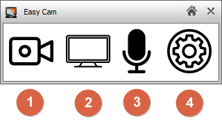
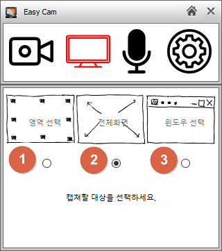
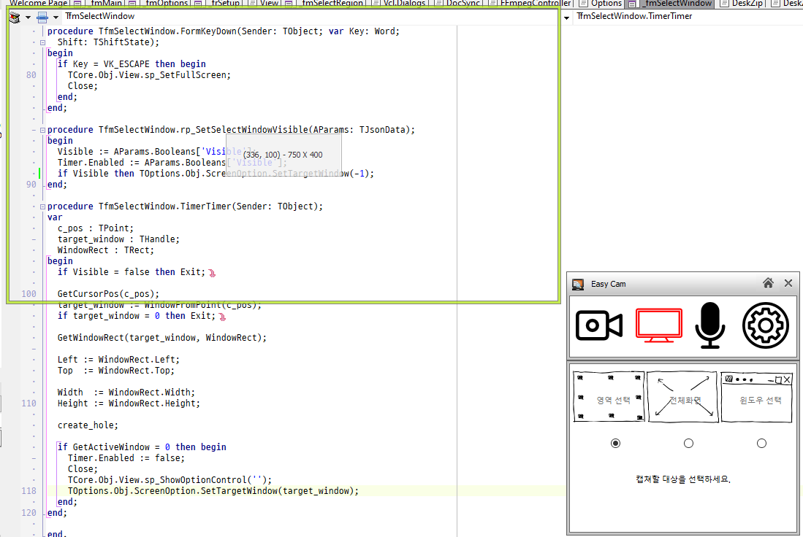
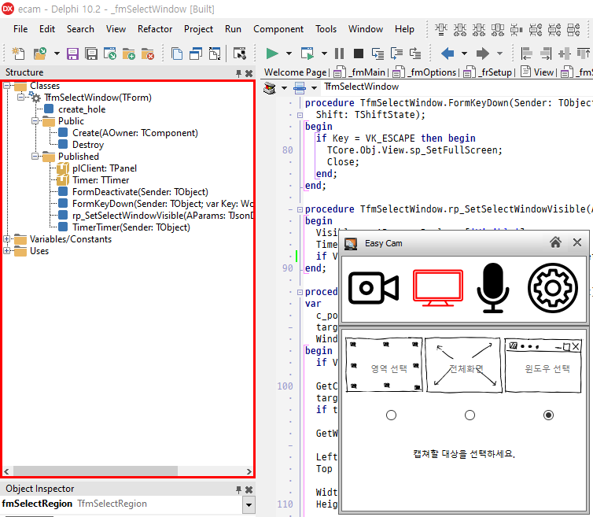
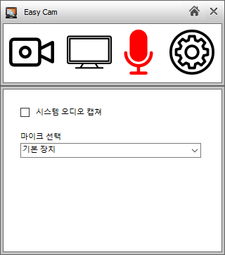
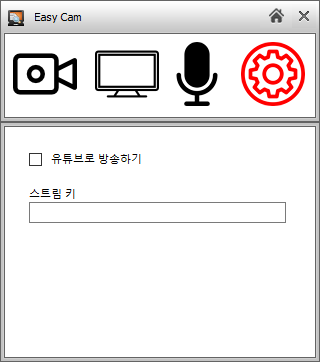
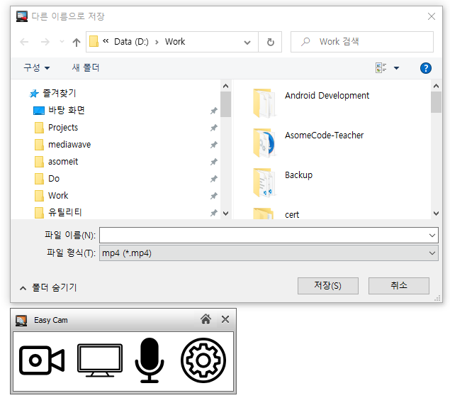

# How to use

## 초기화면

1. 녹화 시작 / 중지 버튼
2. 화면 영역 선택
3. 오디오 선택
4. 기타 설정

## 화면 영역 선택

1. 영역을 지정하여 녹화
2. 전체 화면을 녹화
3. 선택한 윈도우 화면만 녹화

### 영역을 지정하여 녹화하는 장면

* 녹색의 테두리 안쪽이 녹화됩니다.
* 테두리를 마우스로 드래그 하면 크기를 변경할 수 있습니다.
* 가운데 화면 정보 판을 드래그하면 이동할 수 있습니다.

### 선택한 윈도우만 녹화하는 장면

* 마우스를 녹화할 윈도우 컨트롤 위에 올려두면 빨간 테두리가 보입니다. 이때 윈도우를 클릭하면 선택이 됩니다.
* ESC키를 클릭하면 취소되고 전체 화면 녹화가 선택됩니다.

## 오디오 선택

* 녹음할 오디오를 선택하는 화면입니다.
* 시스템 오디오 캡쳐
  * 컴퓨터에서 재생되는 모든 소리를 녹음합니다.
* 마이크 선택
  * 녹을 할 마이크 장치를 선택합니다.

## 기타 설정

* 현재 기타 설정에는 유튜브 방송에 관한 것만 제공합니다.
* 유튜브 방송 중에는 녹화 파일이 생기지 않습니다.

## 녹화가 끝나면 녹화 파일을 저장할 곳을 물어봅니다.

* 취소를 하면 녹화 파일이 삭제됩니다. 주의하세요.
* 임시 파일은 사용자의 임시 폴도에 저장됩니다. 보통은 C: 드라이브입니다. 다른 드라이브로 저장할 때에는 조금 시간이 걸릴 수도 있습니다.